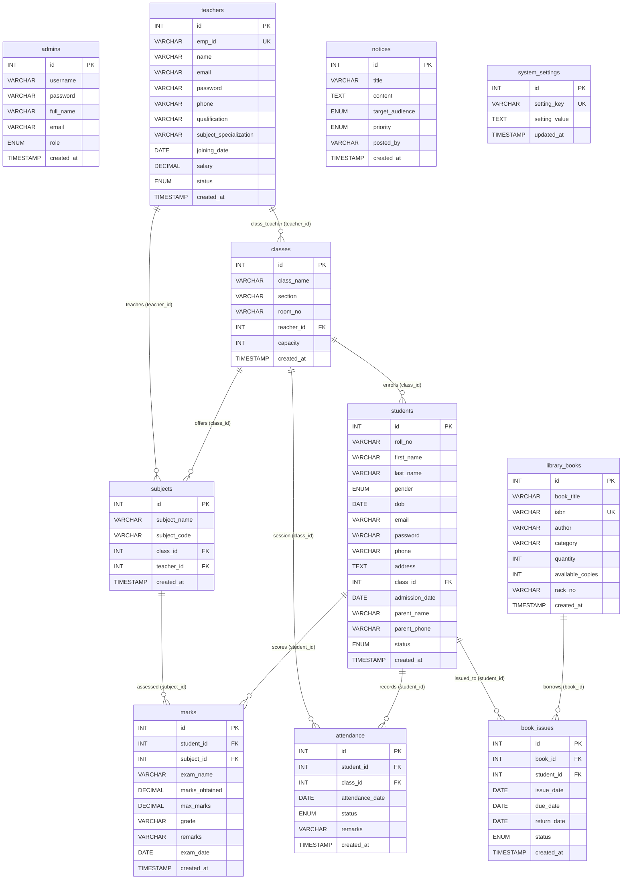

# Database Architecture & Table Reference Guide

This document provides a comprehensive breakdown of the database schema for the **EduCore School Management System (SMS)**. It catalogs all **active database tables** currently in use in the new version, as well as all **legacy/deprecated tables** from older iterations that are no longer used.

---

## 1. Database Architecture Overview

The application utilizes a normalized, relational MySQL database (`school_db`) configured via [`connection.php`](file:///c:/xampp/htdocs/school-management-system-php/connection.php).

* **Database Engine**: `InnoDB` (supports foreign keys, constraints, and ACID transactions).
* **Character Set & Collation**: `utf8mb4` / `utf8mb4_unicode_ci`.
* **Security**: Bcrypt password hashing (`PASSWORD_BCRYPT`) and 100% prepared SQL statements across all modules.
* **Schema Files**:
  * Active Schema & Seed Data: [`database.sql`](file:///c:/xampp/htdocs/school-management-system-php/database.sql) & [`db/school_db.sql`](file:///c:/xampp/htdocs/school-management-system-php/db/school_db.sql)
  * Legacy Cleanup Script: [`clean_database.sql`](file:///c:/xampp/htdocs/school-management-system-php/clean_database.sql)
  * Auto-Synchronizer: `ensure_tables_exist()` in [`connection.php`](file:///c:/xampp/htdocs/school-management-system-php/connection.php)

---

## 2. Entity-Relationship Diagram (Active Schema)



---

## 3. Current Active Database Tables (New Version)

The new normalized version uses exactly **11 active tables**. All operational modules, forms, dynamic reports, and authentication mechanisms interact exclusively with these tables.

### 1. `admins`
* **Purpose**: Manages administrative staff accounts, authentication credentials, and role-based permissions (`Super Admin`, `Admin`, `Staff`).
* **Active Code References**:
  * [`login.php`](file:///c:/xampp/htdocs/school-management-system-php/login.php) (Auth verification)
  * [`includes/auth.php`](file:///c:/xampp/htdocs/school-management-system-php/includes/auth.php) (Role enforcement)
  * [`settings/index.php`](file:///c:/xampp/htdocs/school-management-system-php/settings/index.php) (Staff management tab)
  * [`settings/user_create.php`](file:///c:/xampp/htdocs/school-management-system-php/settings/user_create.php) (Staff provisioning)
  * [`settings/user_edit.php`](file:///c:/xampp/htdocs/school-management-system-php/settings/user_edit.php) (Staff modification)
  * [`settings/user_delete.php`](file:///c:/xampp/htdocs/school-management-system-php/settings/user_delete.php) (Safe deletion)
  * [`profile.php`](file:///c:/xampp/htdocs/school-management-system-php/profile.php) (Admin self-service profile)

| Column Name | Data Type | Null | Default | Key | Description |
| :--- | :--- | :---: | :--- | :---: | :--- |
| `id` | `INT(11)` | No | Auto Increment | **PK** | Unique primary administrator ID |
| `username` | `VARCHAR(50)` | No | None | **UNI** | Unique login handle / username |
| `password` | `VARCHAR(255)` | No | None | | Bcrypt password hash |
| `full_name` | `VARCHAR(100)` | No | None | | Full name of the admin/staff member |
| `email` | `VARCHAR(100)` | No | None | | Official contact email |
| `role` | `ENUM('Super Admin','Admin','Staff')` | No | `'Admin'` | | Role access control level |
| `created_at` | `TIMESTAMP` | No | `CURRENT_TIMESTAMP` | | Record creation timestamp |

---

### 2. `teachers`
* **Purpose**: Stores complete teacher records, employee codes, specializations, credentials, contact information, salaries, and employment status.
* **Active Code References**:
  * [`teachers/index.php`](file:///c:/xampp/htdocs/school-management-system-php/teachers/index.php) (Faculty directory)
  * [`teachers/create.php`](file:///c:/xampp/htdocs/school-management-system-php/teachers/create.php) (Register instructor)
  * [`teachers/edit.php`](file:///c:/xampp/htdocs/school-management-system-php/teachers/edit.php) (Update instructor)
  * [`teachers/delete.php`](file:///c:/xampp/htdocs/school-management-system-php/teachers/delete.php) (Remove instructor)
  * [`settings/index.php`](file:///c:/xampp/htdocs/school-management-system-php/settings/index.php) (Teachers tab)
  * [`settings/reset_temp_pass.php`](file:///c:/xampp/htdocs/school-management-system-php/settings/reset_temp_pass.php) (Password reset)
  * [`classes/index.php`](file:///c:/xampp/htdocs/school-management-system-php/classes/index.php) (Assigned teacher lookup)

| Column Name | Data Type | Null | Default | Key | Description |
| :--- | :--- | :---: | :--- | :---: | :--- |
| `id` | `INT(11)` | No | Auto Increment | **PK** | Unique internal teacher ID |
| `emp_id` | `VARCHAR(20)` | No | None | **UNI** | Unique employee ID (e.g. `EMP-101`) |
| `name` | `VARCHAR(100)` | No | None | | Full name of teacher |
| `email` | `VARCHAR(100)` | No | None | | Official teacher email |
| `password` | `VARCHAR(255)` | No | Default hash | | Bcrypt password hash for portal login |
| `phone` | `VARCHAR(20)` | No | None | | Contact phone number |
| `qualification` | `VARCHAR(100)` | No | None | | Academic qualification (e.g. `M.Sc`, `Ph.D`) |
| `subject_specialization`| `VARCHAR(100)` | No | None | | Major field of specialization |
| `joining_date` | `DATE` | No | None | | Employment commencement date |
| `salary` | `DECIMAL(10,2)`| No | `0.00` | | Monthly compensation amount |
| `status` | `ENUM('Active','On Leave','Resigned')` | No | `'Active'` | | Faculty active status |
| `created_at` | `TIMESTAMP` | No | `CURRENT_TIMESTAMP` | | Account creation timestamp |

---

### 3. `classes`
* **Purpose**: Defines institutional grades/classes, section divisions, assigned classrooms, assigned class teachers, and student capacities.
* **Active Code References**:
  * [`classes/index.php`](file:///c:/xampp/htdocs/school-management-system-php/classes/index.php) (Class list & capacity)
  * [`classes/create.php`](file:///c:/xampp/htdocs/school-management-system-php/classes/create.php) (Add new class)
  * [`classes/edit.php`](file:///c:/xampp/htdocs/school-management-system-php/classes/edit.php) (Update class)
  * [`classes/delete.php`](file:///c:/xampp/htdocs/school-management-system-php/classes/delete.php) (Delete class)
  * [`students/create.php`](file:///c:/xampp/htdocs/school-management-system-php/students/create.php) & [`students/edit.php`](file:///c:/xampp/htdocs/school-management-system-php/students/edit.php) (Class selector)
  * [`attendance/index.php`](file:///c:/xampp/htdocs/school-management-system-php/attendance/index.php) & [`attendance/report.php`](file:///c:/xampp/htdocs/school-management-system-php/attendance/report.php) (Class filter)

| Column Name | Data Type | Null | Default | Key | Description |
| :--- | :--- | :---: | :--- | :---: | :--- |
| `id` | `INT(11)` | No | Auto Increment | **PK** | Primary class ID |
| `class_name` | `VARCHAR(50)` | No | None | | Grade name (e.g. `Grade 5`, `Grade 10`) |
| `section` | `VARCHAR(10)` | No | None | | Section identifier (e.g. `A`, `B`) |
| `room_no` | `VARCHAR(20)` | No | None | | Classroom room number (e.g. `Room 101`) |
| `teacher_id` | `INT(11)` | Yes | `NULL` | **FK** | Foreign key to `teachers.id` (Class Teacher) |
| `capacity` | `INT(11)` | No | `40` | | Maximum student capacity |
| `created_at` | `TIMESTAMP` | No | `CURRENT_TIMESTAMP` | | Record creation timestamp |

---

### 4. `students`
* **Purpose**: Centralized student repository containing student bio, roll numbers, credentials, address, class enrollment, parent details, and admission status.
* **Active Code References**:
  * [`students/index.php`](file:///c:/xampp/htdocs/school-management-system-php/students/index.php) (Student directory)
  * [`students/create.php`](file:///c:/xampp/htdocs/school-management-system-php/students/create.php) (New student admission)
  * [`students/edit.php`](file:///c:/xampp/htdocs/school-management-system-php/students/edit.php) (Update student)
  * [`students/view.php`](file:///c:/xampp/htdocs/school-management-system-php/students/view.php) (Student profile & report)
  * [`students/delete.php`](file:///c:/xampp/htdocs/school-management-system-php/students/delete.php) (Delete student)
  * [`attendance/index.php`](file:///c:/xampp/htdocs/school-management-system-php/attendance/index.php) (Attendance roster)
  * [`results/create.php`](file:///c:/xampp/htdocs/school-management-system-php/results/create.php) (Student grade entry)
  * [`library/issue.php`](file:///c:/xampp/htdocs/school-management-system-php/library/issue.php) (Book checkout lookup)

| Column Name | Data Type | Null | Default | Key | Description |
| :--- | :--- | :---: | :--- | :---: | :--- |
| `id` | `INT(11)` | No | Auto Increment | **PK** | Primary student ID |
| `roll_no` | `VARCHAR(20)` | No | None | | Unique Roll / Student code (e.g. `STD-1001`) |
| `first_name` | `VARCHAR(50)` | No | None | | Student first name |
| `last_name` | `VARCHAR(50)` | No | None | | Student last name |
| `gender` | `ENUM('Male','Female','Other')` | No | None | | Student gender |
| `dob` | `DATE` | No | None | | Date of birth |
| `email` | `VARCHAR(100)` | Yes | `NULL` | | Student email address |
| `password` | `VARCHAR(255)` | No | Default hash | | Bcrypt password hash for student login |
| `phone` | `VARCHAR(20)` | Yes | `NULL` | | Contact telephone |
| `address` | `TEXT` | No | None | | Residential address |
| `class_id` | `INT(11)` | No | None | **FK** | Foreign key to `classes.id` |
| `admission_date`| `DATE` | No | None | | Date student was admitted |
| `parent_name` | `VARCHAR(100)`| No | None | | Parent / Guardian full name |
| `parent_phone`| `VARCHAR(20)` | No | None | | Parent emergency contact |
| `status` | `ENUM('Active','Inactive','Graduated','Suspended')` | No | `'Active'` | | Current enrollment status |
| `created_at` | `TIMESTAMP` | No | `CURRENT_TIMESTAMP` | | Registration timestamp |

---

### 5. `subjects`
* **Purpose**: Catalogs curriculum subjects linked to specific classes and assigned teachers.
* **Active Code References**:
  * [`results/create.php`](file:///c:/xampp/htdocs/school-management-system-php/results/create.php) (Subject dropdown for marks)
  * [`results/index.php`](file:///c:/xampp/htdocs/school-management-system-php/results/index.php) (Subject grade filter)
  * [`students/view.php`](file:///c:/xampp/htdocs/school-management-system-php/students/view.php) (Academic transcript)
  * [`reports/index.php`](file:///c:/xampp/htdocs/school-management-system-php/reports/index.php) (Curriculum breakdown)

| Column Name | Data Type | Null | Default | Key | Description |
| :--- | :--- | :---: | :--- | :---: | :--- |
| `id` | `INT(11)` | No | Auto Increment | **PK** | Primary subject ID |
| `subject_name` | `VARCHAR(100)`| No | None | | Course title (e.g. `Mathematics`) |
| `subject_code` | `VARCHAR(20)` | No | None | | Subject code (e.g. `MATH-10`) |
| `class_id` | `INT(11)` | No | None | **FK** | Foreign key to `classes.id` |
| `teacher_id` | `INT(11)` | Yes | `NULL` | **FK** | Foreign key to `teachers.id` |
| `created_at` | `TIMESTAMP` | No | `CURRENT_TIMESTAMP` | | Creation timestamp |

---

### 6. `attendance`
* **Purpose**: Unified daily attendance register tracking daily statuses (`Present`, `Absent`, `Late`, `Excused`) for all students across any date and class.
* **Active Code References**:
  * [`attendance/index.php`](file:///c:/xampp/htdocs/school-management-system-php/attendance/index.php) (Attendance marking)
  * [`attendance/report.php`](file:///c:/xampp/htdocs/school-management-system-php/attendance/report.php) (Class-wise & Monthly analysis)
  * [`students/view.php`](file:///c:/xampp/htdocs/school-management-system-php/students/view.php) (Student attendance rate)
  * [`index.php`](file:///c:/xampp/htdocs/school-management-system-php/index.php) (Today's attendance metrics)

| Column Name | Data Type | Null | Default | Key | Description |
| :--- | :--- | :---: | :--- | :---: | :--- |
| `id` | `INT(11)` | No | Auto Increment | **PK** | Primary attendance record ID |
| `student_id` | `INT(11)` | No | None | **FK** | Foreign key to `students.id` |
| `class_id` | `INT(11)` | No | None | **FK** | Foreign key to `classes.id` |
| `attendance_date`| `DATE` | No | None | | Date of attendance session |
| `status` | `ENUM('Present','Absent','Late','Excused')` | No | `'Present'` | | Attendance mark |
| `remarks` | `VARCHAR(255)`| Yes | `NULL` | | Optional notes (e.g. `Doctor appointment`) |
| `created_at` | `TIMESTAMP` | No | `CURRENT_TIMESTAMP` | | Record timestamp |

> [!NOTE]
> Contains a compound unique key `uniq_attendance` on `(student_id, attendance_date)` to prevent duplicate records per day.

---

### 7. `marks`
* **Purpose**: Standardized academic grading ledger recording exam results, marks scored, maximum marks, letter grades, and examiner remarks.
* **Active Code References**:
  * [`results/index.php`](file:///c:/xampp/htdocs/school-management-system-php/results/index.php) (Gradebook overview)
  * [`results/create.php`](file:///c:/xampp/htdocs/school-management-system-php/results/create.php) (Record marks)
  * [`results/edit.php`](file:///c:/xampp/htdocs/school-management-system-php/results/edit.php) (Update marks)
  * [`results/delete.php`](file:///c:/xampp/htdocs/school-management-system-php/results/delete.php) (Delete mark record)
  * [`students/view.php`](file:///c:/xampp/htdocs/school-management-system-php/students/view.php) (Report card view)
  * [`reports/index.php`](file:///c:/xampp/htdocs/school-management-system-php/reports/index.php) (Academic performance stats)

| Column Name | Data Type | Null | Default | Key | Description |
| :--- | :--- | :---: | :--- | :---: | :--- |
| `id` | `INT(11)` | No | Auto Increment | **PK** | Primary mark record ID |
| `student_id` | `INT(11)` | No | None | **FK** | Foreign key to `students.id` |
| `subject_id` | `INT(11)` | No | None | **FK** | Foreign key to `subjects.id` |
| `exam_name` | `VARCHAR(50)` | No | None | | Exam title (e.g. `Midterm Exam`, `Final Exam`) |
| `marks_obtained`| `DECIMAL(5,2)`| No | None | | Score earned |
| `max_marks` | `DECIMAL(5,2)`| No | `100.00` | | Maximum attainable score |
| `grade` | `VARCHAR(5)` | No | None | | Calculated letter grade (`A+`, `A`, `B+`, etc.) |
| `remarks` | `VARCHAR(255)`| Yes | `NULL` | | Teacher feedback |
| `exam_date` | `DATE` | No | None | | Date of examination |
| `created_at` | `TIMESTAMP` | No | `CURRENT_TIMESTAMP` | | Entry timestamp |

---

### 8. `library_books`
* **Purpose**: Inventory catalog of all library books, tracking unique ISBNs, authors, genres, total stock, and available shelf copies.
* **Active Code References**:
  * [`library/index.php`](file:///c:/xampp/htdocs/school-management-system-php/library/index.php) (Book catalog)
  * [`library/create.php`](file:///c:/xampp/htdocs/school-management-system-php/library/create.php) (Add book to inventory)
  * [`library/edit.php`](file:///c:/xampp/htdocs/school-management-system-php/library/edit.php) (Edit book details)
  * [`library/delete.php`](file:///c:/xampp/htdocs/school-management-system-php/library/delete.php) (Delete book)
  * [`library/issue.php`](file:///c:/xampp/htdocs/school-management-system-php/library/issue.php) (Borrowing stock decrement)

| Column Name | Data Type | Null | Default | Key | Description |
| :--- | :--- | :---: | :--- | :---: | :--- |
| `id` | `INT(11)` | No | Auto Increment | **PK** | Primary book ID |
| `book_title` | `VARCHAR(150)`| No | None | | Book title |
| `isbn` | `VARCHAR(30)` | No | None | **UNI** | Unique ISBN number |
| `author` | `VARCHAR(100)`| No | None | | Author name |
| `category` | `VARCHAR(50)` | No | None | | Genre / Subject category |
| `quantity` | `INT(11)` | No | `1` | | Total copies owned |
| `available_copies`| `INT(11)` | No | `1` | | Currently available shelf copies |
| `rack_no` | `VARCHAR(20)` | No | None | | Shelf location (e.g. `Rack CS-01`) |
| `created_at` | `TIMESTAMP` | No | `CURRENT_TIMESTAMP` | | Record timestamp |

---

### 9. `book_issues`
* **Purpose**: Manages library circulation, active book checkouts, borrower links, return deadlines, and overdue states.
* **Active Code References**:
  * [`library/issue.php`](file:///c:/xampp/htdocs/school-management-system-php/library/issue.php) (Issue & return operations)
  * [`library/index.php`](file:///c:/xampp/htdocs/school-management-system-php/library/index.php) (Active circulation counts)
  * [`index.php`](file:///c:/xampp/htdocs/school-management-system-php/index.php) (Overdue loan notifications)
  * [`reports/index.php`](file:///c:/xampp/htdocs/school-management-system-php/reports/index.php) (Circulation metrics)

| Column Name | Data Type | Null | Default | Key | Description |
| :--- | :--- | :---: | :--- | :---: | :--- |
| `id` | `INT(11)` | No | Auto Increment | **PK** | Primary issue transaction ID |
| `book_id` | `INT(11)` | No | None | **FK** | Foreign key to `library_books.id` |
| `student_id` | `INT(11)` | No | None | **FK** | Foreign key to `students.id` |
| `issue_date` | `DATE` | No | None | | Date borrowed |
| `due_date` | `DATE` | No | None | | Date due for return |
| `return_date`| `DATE` | Yes | `NULL` | | Actual return date |
| `status` | `ENUM('Issued','Returned','Overdue')` | No | `'Issued'` | | Current loan status |
| `created_at` | `TIMESTAMP` | No | `CURRENT_TIMESTAMP` | | Transaction timestamp |

---

### 10. `notices`
* **Purpose**: Centralized digital bulletin board for posting announcements filtered by target audience (`All`, `Students`, `Teachers`, `Parents`) and priority (`Normal`, `Important`, `Urgent`).
* **Active Code References**:
  * [`notices/index.php`](file:///c:/xampp/htdocs/school-management-system-php/notices/index.php) (Notice feed)
  * [`notices/create.php`](file:///c:/xampp/htdocs/school-management-system-php/notices/create.php) (Post announcement)
  * [`notices/edit.php`](file:///c:/xampp/htdocs/school-management-system-php/notices/edit.php) (Edit announcement)
  * [`notices/delete.php`](file:///c:/xampp/htdocs/school-management-system-php/notices/delete.php) (Delete announcement)
  * [`index.php`](file:///c:/xampp/htdocs/school-management-system-php/index.php) (Dashboard notice feed)

| Column Name | Data Type | Null | Default | Key | Description |
| :--- | :--- | :---: | :--- | :---: | :--- |
| `id` | `INT(11)` | No | Auto Increment | **PK** | Primary notice ID |
| `title` | `VARCHAR(150)`| No | None | | Announcement title |
| `content` | `TEXT` | No | None | | Detailed notice content |
| `target_audience`| `ENUM('All','Students','Teachers','Parents')` | No | `'All'` | | Visible target audience |
| `priority` | `ENUM('Normal','Important','Urgent')` | No | `'Normal'` | | Urgency indicator |
| `posted_by` | `VARCHAR(100)`| No | `'Administration'` | | Author / Publishing body |
| `created_at` | `TIMESTAMP` | No | `CURRENT_TIMESTAMP` | | Post timestamp |

---

### 11. `system_settings`
* **Purpose**: Global key-value configuration repository storing school branding, contact details, academic session, currency symbol, and platform settings.
* **Active Code References**:
  * [`settings/index.php`](file:///c:/xampp/htdocs/school-management-system-php/settings/index.php) (Settings tab)
  * [`includes/header.php`](file:///c:/xampp/htdocs/school-management-system-php/includes/header.php) (School branding & meta)
  * [`includes/footer.php`](file:///c:/xampp/htdocs/school-management-system-php/includes/footer.php) (Copyright & session year)
  * [`connection.php`](file:///c:/xampp/htdocs/school-management-system-php/connection.php) (Default settings seed)

| Column Name | Data Type | Null | Default | Key | Description |
| :--- | :--- | :---: | :--- | :---: | :--- |
| `id` | `INT(11)` | No | Auto Increment | **PK** | Setting row ID |
| `setting_key` | `VARCHAR(50)` | No | None | **UNI** | Unique configuration key |
| `setting_value`| `TEXT` | No | None | | Configuration value string |
| `updated_at` | `TIMESTAMP` | No | `CURRENT_TIMESTAMP` | | Last updated timestamp |

---

## 4. Legacy / Old Database Tables (No Longer Used)

The following **27 legacy tables** were created in older, prototype iterations of the system (e.g. in [`db/student.sql`](file:///c:/xampp/htdocs/school-management-system-php/db/student.sql)). They have been completely replaced by normalized relational tables and are **safe to drop** using [`clean_database.sql`](file:///c:/xampp/htdocs/school-management-system-php/clean_database.sql).

### Detailed Breakdown of Deprecated Tables

| # | Legacy Table Name | Former Purpose | Reason No Longer Used | Replaced By (New Version) | Legacy Associated Files |
| :-: | :--- | :--- | :--- | :--- | :--- |
| **1** | `admin_login` | Primitive admin login (plain-text user & pass). | Replaced by multi-role RBAC with bcrypt hashing. | [`admins`](#1-admins) | `admin_login.php`, `login.php` (old) |
| **2** | `teachers_admin` | Secondary admin table for teachers. | Redundant; teacher privileges merged into RBAC. | [`teachers`](#2-teachers) & [`admins`](#1-admins) | `admin_teachers.php` |
| **3** | `t_reg` | Teacher registration log. | Denormalized table with plain-text credentials. | [`teachers`](#2-teachers) | `t_login.php`, `teachers_profile.php` |
| **4** | `student_admission` | Initial student registration table. | Unnormalized flat table without foreign keys. | [`students`](#4-students) | `admision.php` |
| **5** | `student_admission6`| Duplicate student admission table for Grade 6. | Redundant duplicate per-grade table. | [`students`](#4-students) | `admission6.php` |
| **6** | `class_five` | Hardcoded student table for Grade 5. | Replaced by single normalized `students` table linked via `class_id`. | [`students`](#4-students) + [`classes`](#3-classes) | `class_five.php`, `tab_five.php`, `tab_five_update.php` |
| **7** | `class_six` | Hardcoded student table for Grade 6. | Replaced by single normalized `students` table linked via `class_id`. | [`students`](#4-students) + [`classes`](#3-classes) | `class_six.php`, `tab_six.php`, `tab_six_update.php` |
| **8** | `class_seven` | Hardcoded student table for Grade 7. | Replaced by single normalized `students` table linked via `class_id`. | [`students`](#4-students) + [`classes`](#3-classes) | `class_seven.php`, `tab_seven.php`, `tab_seven_update.php` |
| **9** | `class_eight` | Hardcoded student table for Grade 8. | Replaced by single normalized `students` table linked via `class_id`. | [`students`](#4-students) + [`classes`](#3-classes) | `class_eight.php`, `tab_eight.php`, `tab_eight_update.php` |
| **10** | `class_nine` | Hardcoded student table for Grade 9. | Replaced by single normalized `students` table linked via `class_id`. | [`students`](#4-students) + [`classes`](#3-classes) | `class_nine.php`, `tab_nine.php`, `tab_nine_update.php` |
| **11** | `class_ten` | Hardcoded student table for Grade 10. | Replaced by single normalized `students` table linked via `class_id`. | [`students`](#4-students) + [`classes`](#3-classes) | `class_ten.php`, `tab_ten.php`, `tab_ten_update.php` |
| **12** | `res_five` | Hardcoded exam results for Grade 5. | Hardcoded subject columns replaced by relational `marks` table. | [`marks`](#7-marks) | `res_five.php` |
| **13** | `res_six` | Hardcoded exam results for Grade 6. | Hardcoded subject columns replaced by relational `marks` table. | [`marks`](#7-marks) | `res_six.php` |
| **14** | `res_seven` | Hardcoded exam results for Grade 7. | Hardcoded subject columns replaced by relational `marks` table. | [`marks`](#7-marks) | `res_seven.php` |
| **15** | `res_eight` | Hardcoded exam results for Grade 8. | Hardcoded subject columns replaced by relational `marks` table. | [`marks`](#7-marks) | `res_eight.php` |
| **16** | `res_nine` | Hardcoded exam results for Grade 9. | Hardcoded subject columns replaced by relational `marks` table. | [`marks`](#7-marks) | `res_nine.php` |
| **17** | `res_ten` | Hardcoded exam results for Grade 10. | Hardcoded subject columns replaced by relational `marks` table. | [`marks`](#7-marks) | `res_ten.php` |
| **18** | `result_five` | Duplicate Grade 5 result storage table. | Unnormalized duplicate schema replaced by relational `marks`. | [`marks`](#7-marks) | `result_class_five.php`, `result_five_update.php` |
| **19** | `result_six` | Duplicate Grade 6 result storage table. | Unnormalized duplicate schema replaced by relational `marks`. | [`marks`](#7-marks) | `result_class_six.php`, `result_six_update.php` |
| **20** | `result_seven` | Duplicate Grade 7 result storage table. | Unnormalized duplicate schema replaced by relational `marks`. | [`marks`](#7-marks) | `result_class_seven.php`, `result_seven_update.php` |
| **21** | `result_eight` | Duplicate Grade 8 result storage table. | Unnormalized duplicate schema replaced by relational `marks`. | [`marks`](#7-marks) | `result_class_eight.php`, `result_eight_update.php` |
| **22** | `result_nine` | Duplicate Grade 9 result storage table. | Unnormalized duplicate schema replaced by relational `marks`. | [`marks`](#7-marks) | `result_class_nine.php`, `result_nine_update.php` |
| **23** | `result_ten` | Duplicate Grade 10 result storage table. | Unnormalized duplicate schema replaced by relational `marks`. | [`marks`](#7-marks) | `result_class_ten.php`, `result_ten_update.php` |
| **24** | `tab_five` - `tab_ten` | Tabulation sheets per class. | Dynamic SQL queries generate reports automatically on-demand. | [`marks`](#7-marks) & [`reports/index.php`](file:///c:/xampp/htdocs/school-management-system-php/reports/index.php) | `tab_five.php` through `tab_ten.php` |
| **25** | `atten` | Primitive single-column attendance test table. | Stored student names without date/class relationships. | [`attendance`](#6-attendance) | `at.php`, `admin_atendance.php` |
| **26** | `attent_five` | Attendance table restricted only to Grade 5. | Replaced by single multi-grade `attendance` register. | [`attendance`](#6-attendance) | `atten_five.php`, `atten_sub_five.php` |
| **27** | `library_details` | Flat book issue list. | Combined book metadata and loan dates into one table without foreign keys. | [`library_books`](#8-library_books) + [`book_issues`](#9-book_issues) | `admin_library.php`, `library.php`, `update.php` |
| **28** | `library_log` | Separate librarian login table. | Plain-text logins; librarian functions merged into Staff RBAC. | [`admins`](#1-admins) (Role: Staff) | `library_login.php`, `library_profile.php` |
| **29** | `library_admin` | Library admin management table. | Redundant; replaced by centralized permissions matrix. | [`admins`](#1-admins) | `admin_library_show.php` |
| **30** | `notice` | Legacy notice table with string dates. | Replaced by structured `notices` table with priority and audience filters. | [`notices`](#10-notices) | `notice.php`, `notice_show.php`, `notice_update.php` |
| **31** | `notices_admin` | Notice administrator control table. | Redundant; notice posting managed via Staff/Admin RBAC. | [`notices`](#10-notices) & [`admins`](#1-admins) | `notice_admin.php` |
| **32** | `report` / `report_issues` | Student issue/grievance reporting log. | Unstructured string log; replaced by modern reporting & analytics engine. | [`reports/index.php`](file:///c:/xampp/htdocs/school-management-system-php/reports/index.php) | `report.php`, `admin_report_show.php`, `report_delete.php` |

---

## 5. Master Architecture Comparison & Migration Mapping

```
LEGACY ARCHITECTURE (Old Version)                   MODERN ARCHITECTURE (Current Version)
─────────────────────────────────────────────────   ─────────────────────────────────────────────────────
• 6 separate student tables (class_five ... ten)  ──>  Single normalized `students` table (FK: class_id)
• 12 separate result tables (res_* & result_*)    ──>  Single unified `marks` table (FK: student_id, subject_id)
• Separate `atten` & `attent_five` tables         ──>  Unified `attendance` table (Compound UK: student_id + date)
• Flat `library_details` & `library_log` tables   ──>  Relational `library_books` + `book_issues` tables
• Plain-text login tables (`admin_login`, etc.)   ──>  Role-Based Access Control (`admins`, `teachers`, `students`)
• Hardcoded school data in PHP views              ──>  Key-Value configuration in `system_settings`
```

---

## 6. SQL Cleanup Queries to Remove All Deprecated Tables

You can run the following SQL query directly in **phpMyAdmin** (SQL tab) or the MySQL CLI to safely drop all deprecated tables:

```sql
-- Disable foreign key checks to prevent dependency conflicts during cleanup
SET FOREIGN_KEY_CHECKS = 0;

-- Drop all 32+ deprecated / legacy tables in a single command
DROP TABLE IF EXISTS 
    `admin_login`,
    `teachers_admin`,
    `t_reg`,
    `student_admission`,
    `student_admission6`,
    `class_five`,
    `class_six`,
    `class_seven`,
    `class_eight`,
    `class_nine`,
    `class_ten`,
    `res_five`,
    `res_six`,
    `res_seven`,
    `res_eight`,
    `res_nine`,
    `res_ten`,
    `result_five`,
    `result_six`,
    `result_seven`,
    `result_eight`,
    `result_nine`,
    `result_ten`,
    `tab_five`,
    `tab_six`,
    `tab_seven`,
    `tab_eight`,
    `tab_nine`,
    `tab_ten`,
    `atten`,
    `attent_five`,
    `library_details`,
    `library_log`,
    `library_admin`,
    `notice`,
    `notices_admin`,
    `report`,
    `report_issues`;

-- Re-enable foreign key checks
SET FOREIGN_KEY_CHECKS = 1;

-- Verify that only the 11 active tables remain
SHOW TABLES;
```

> [!TIP]
> The full cleanup script is also saved as [`clean_database.sql`](file:///c:/xampp/htdocs/school-management-system-php/clean_database.sql) which you can import directly.
