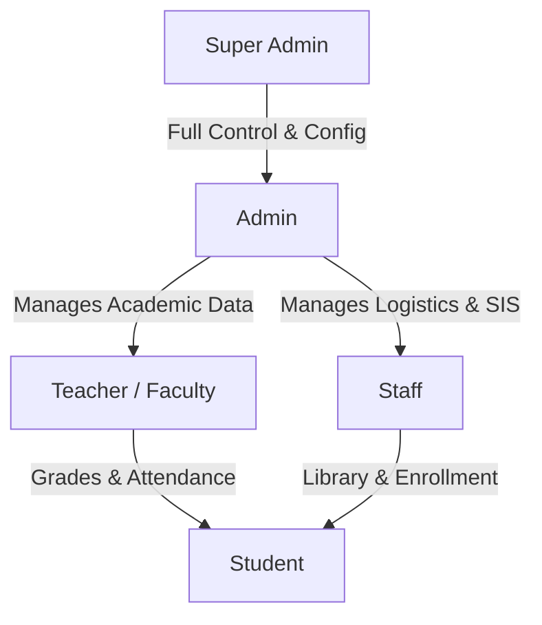
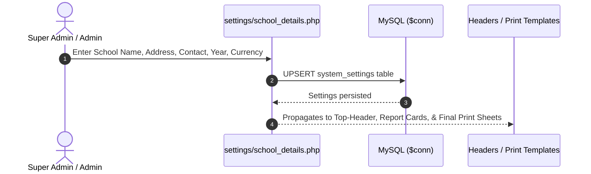
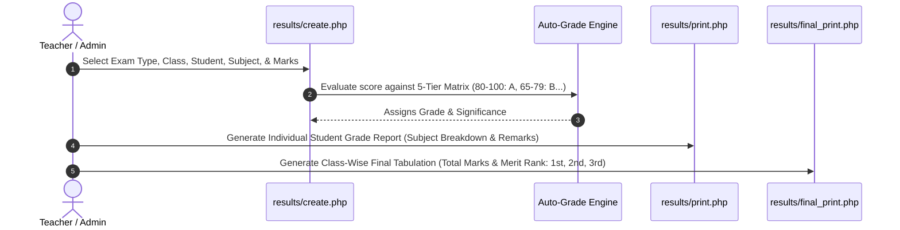
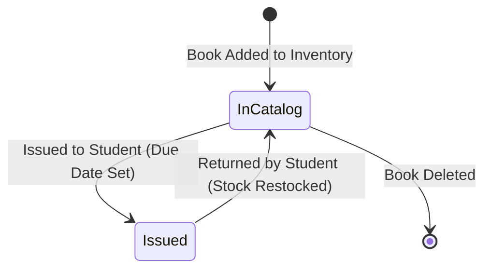
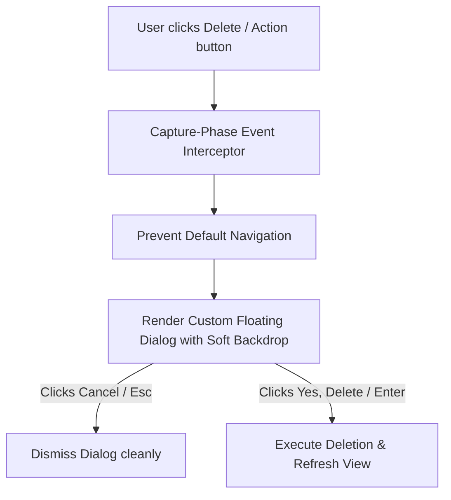

# EduCore School Management System - Business Flow & System Functionality Guide

## 1. Executive Summary

**EduCore SMS** is a centralized, role-based PHP & MySQL institutional management platform designed for primary and secondary educational institutions. It digitizes administrative workflows, student academic records, faculty allocations, exam grading and rank calculations, library circulation, and institutional communications within a modern, glassmorphic dark UI.

> [!TIP]
> For the database schema, entity attributes, foreign keys, and relational cardinality models, see the complete [**Entity-Relationship (ER) Diagram & Relational Flow Architecture**](ENTITY_RELATIONSHIP_DIAGRAM.md).

---

## 2. User Roles & Access Control Matrix

The platform implements strict **Role-Based Access Control (RBAC)** across five distinct user roles:

| Functional Section | Super Admin | Admin | Staff | Teacher | Student |
| :--- | :---: | :---: | :---: | :---: | :---: |
| **Dashboard & Institutional Stats** | Full | Full | View | View | View |
| **School Details & System Config** | Full | Full | ❌ | ❌ | ❌ |
| **User & Account Management** | Full | Full | ❌ | ❌ | ❌ |
| **Student Information System (SIS)** | Full | Full | Create / Edit | View Roster | Self Only |
| **Faculty & Teachers Directory** | Full | Full | View | ❌ | ❌ |
| **Classes & Sections** | Full | Full | View | View | Enrolled Only |
| **Daily Attendance Tracking** | Full | Full | Mark / View | Mark / View | Self History |
| **Exam Marks & Gradebook** | Full | Full | View | Record / Edit | Self Report |
| **Individual & Class Final Print** | Full | Full | View / Print | View / Print | Self Print |
| **Library & Book Circulation** | Full | Full | Issue / Return | View Catalog | View Catalog |
| **Notice Board & Announcements** | Full | Full | Post / Edit | View | View |

---

## 3. Core Business Workflows

### 3.1 Initial System Setup & Institutional Configuration Flow

- **Step 1:** The Administrator configures institution metadata (`school_name`, `school_email`, `school_phone`, `school_address`, `academic_year`, `currency_symbol`).
- **Step 2:** System metadata dynamically populates on official student report cards, class merit sheets, and navigation headers.

---

### 3.2 Student Onboarding & Academic Lifecycle

1. **Student Registration (`students/create.php`):**
   - Administrator or Staff inputs student personal details, birth date, gender, blood group, guardian contact, and residential address.
   - System auto-generates a unique Roll Number (e.g. `STD-101`) and assigns the student to an active Class and Section.
2. **Profile & Status (`students/view.php`):**
   - Profiles maintain status indicators: `Active`, `Inactive`, or `Suspended`.
3. **Attendance & Academic Record:**
   - The student is automatically enrolled in daily attendance rosters and examination gradebooks for their class.

---

### 3.3 Examination, Grading, & Merit Ranking Flow

#### Institutional 5-Tier Grading Scale
Academic performance is calculated automatically using the following grading criteria:

| Marks Range | Grade | Significance | Performance Status |
| :---: | :---: | :---: | :---: |
| **80 – 100** | **A** | Very Good | Honors / Excellent |
| **65 – 79** | **B** | Good | Above Average |
| **50 – 64** | **C** | Satisfactory | Average Competency |
| **35 – 49** | **D** | Average | Passing Grade |
| **Below 35** | **E** | Not Satisfactory | Needs Remediation |

#### Step-by-Step Exam & Result Processing

1. **Marks Entry (`results/create.php` & `results/edit.php`):**
   - Teacher selects the exam term (e.g., *First Term Exam 2026*, *Final Exam 2026*), student, subject name, obtained marks, and maximum marks.
   - The system automatically computes percentage, grade, and evaluation remark.
2. **Student Official Print (`results/print.php`):**
   - Displays student demographic details, exam title, individual subject score breakdown, institutional grade legend, teacher remarks, and signature placeholders.
3. **Class Final Merit Tabulation (`results/final_print.php`):**
   - Aggregates all subjects per student for an entire class.
   - Automatically computes total marks obtained, total possible marks, overall percentage, and orders students into **1st, 2nd, 3rd... Academic Ranks**.

---

### 3.4 Library Catalog & Book Circulation Flow

1. **Cataloging (`library/create.php`):**
   - Staff registers books with ISBN, title, author, category, rack location, and total quantity.
2. **Issue Circulation (`library/issue.php`):**
   - Book is allocated to a student with an issue date and return due date. Available inventory is decremented.
3. **Return & Restock:**
   - Clicking **Return** confirms book check-in via custom modal, auto-updates inventory, and logs the return timestamp.

---

### 3.5 System-Wide Confirmation & Action Safeguards

The platform employs a **Custom Confirmation Modal Engine** that eliminates default browser alerts for critical operations:

- **Universal Trigger Coverage:** Intercepts delete actions across Students, Teachers, Classes, Marks, Books, Notices, and User Accounts.
- **Safety Highlighting:** Automatically displays the target entity name (e.g. *Student Alex Johnson (STD-1001)*) inside a highlighted pill badge.
- **Soft Frosted Backdrop:** Uses a lightened translucent blur (`rgba(15, 23, 42, 0.35)`) to preserve context without dark visual obstruction.

---

## 4. Key Module Directory Reference

| Module Path | Primary Functions | Access Permissions |
| :--- | :--- | :--- |
| [`index.php`](file:///c:/xampp/htdocs/school-management-system-php/index.php) | Analytics dashboard, quick actions, role-specific metrics | All authenticated users |
| [`settings/school_details.php`](file:///c:/xampp/htdocs/school-management-system-php/settings/school_details.php) | School branding, address, academic year, and contact config | Super Admin, Admin |
| [`settings/index.php`](file:///c:/xampp/htdocs/school-management-system-php/settings/index.php) | Multi-role user creation, temporary passwords, account status | Super Admin, Admin |
| [`students/index.php`](file:///c:/xampp/htdocs/school-management-system-php/students/index.php) | Student roster, enrollment, filters, profile view, search | Super Admin, Admin, Staff, Teacher |
| [`teachers/index.php`](file:///c:/xampp/htdocs/school-management-system-php/teachers/index.php) | Faculty directory, subject specializations, status | Super Admin, Admin, Staff |
| [`classes/index.php`](file:///c:/xampp/htdocs/school-management-system-php/classes/index.php) | Class creation, sections, assigned teachers, enrollment count | Super Admin, Admin, Staff, Teacher |
| [`attendance/index.php`](file:///c:/xampp/htdocs/school-management-system-php/attendance/index.php) | Roll call tracking, daily attendance grid, summary report | Super Admin, Admin, Staff, Teacher |
| [`results/index.php`](file:///c:/xampp/htdocs/school-management-system-php/results/index.php) | Gradebook, exam marks filters, score management | Super Admin, Admin, Teacher, Student |
| [`results/print.php`](file:///c:/xampp/htdocs/school-management-system-php/results/print.php) | Official student subject report card print view | Super Admin, Admin, Teacher, Student |
| [`results/final_print.php`](file:///c:/xampp/htdocs/school-management-system-php/results/final_print.php) | Class-wise final merit tabulation & rank print sheet | Super Admin, Admin, Teacher |
| [`library/index.php`](file:///c:/xampp/htdocs/school-management-system-php/library/index.php) | Book catalog, shelf location, availability status | Super Admin, Admin, Staff, Student |
| [`library/issue.php`](file:///c:/xampp/htdocs/school-management-system-php/library/issue.php) | Book checkout, active loan tracking, return check-in | Super Admin, Admin, Staff |
| [`notices/index.php`](file:///c:/xampp/htdocs/school-management-system-php/notices/index.php) | Institutional announcements, priority notices, feeds | All authenticated users |
