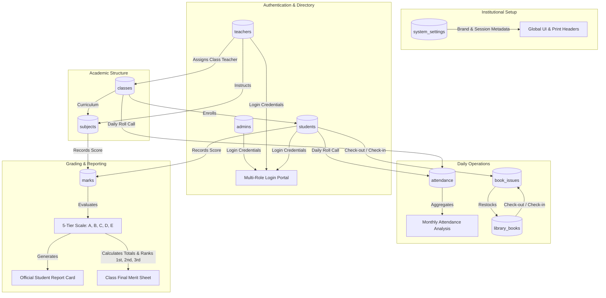

# Entity-Relationship (ER) Diagram & Relational Flow Architecture

## 1. Overview

This document presents the complete **Entity-Relationship (ER) Model** and **Relational Data Flow** for the **EduCore School Management System**.

The database architecture is built on the relational `InnoDB` engine with primary keys, indexed foreign key references, and relational integrity constraints supporting academic tracking, administrative governance, examination computation, and library operations.

---

## 2. Complete Entity-Relationship (ER) Diagram

```mermaid
erDiagram
    %% Core Administrative & Auth Entities
    system_settings {
        INT id PK "Auto Increment"
        VARCHAR setting_key UK "Unique config identifier (school_name, academic_year, etc.)"
        TEXT setting_value "Configuration value"
        TIMESTAMP updated_at "Last modified timestamp"
    }

    admins {
        INT id PK "Auto Increment"
        VARCHAR username UK "Unique login identifier (ADM-xxx, STF-xxx)"
        VARCHAR password "Bcrypt hashed password"
        VARCHAR full_name "Official administrative name"
        VARCHAR email "Contact email address"
        ENUM role "Super Admin | Admin | Staff"
        TIMESTAMP created_at "Account creation date"
    }

    notices {
        INT id PK "Auto Increment"
        VARCHAR title "Announcement heading"
        TEXT content "Detailed notice body"
        ENUM target_audience "All | Students | Teachers | Staff"
        ENUM priority "Normal | Important | Urgent"
        VARCHAR posted_by "Author administrator or teacher"
        TIMESTAMP created_at "Publication timestamp"
    }

    %% Academic Hierarchy Entities
    teachers {
        INT id PK "Auto Increment"
        VARCHAR emp_id UK "Unique Employee ID (EMP-xxx)"
        VARCHAR name "Faculty member full name"
        VARCHAR email "Official faculty email"
        VARCHAR password "Bcrypt hashed password"
        VARCHAR phone "Primary contact number"
        VARCHAR qualification "Highest degree obtained"
        VARCHAR subject_specialization "Subject domain / expertise"
        DATE joining_date "Employment start date"
        DECIMAL salary "Monthly compensation"
        ENUM status "Active | On Leave | Resigned"
        TIMESTAMP created_at "Registration date"
    }

    classes {
        INT id PK "Auto Increment"
        VARCHAR class_name "Academic grade (Grade 1 - Grade 12)"
        VARCHAR section "Section designation (A, B, C, etc.)"
        VARCHAR room_no "Assigned classroom / hall"
        INT teacher_id FK "Assigned Class Teacher (teachers.id)"
        INT capacity "Maximum student seat limit"
        TIMESTAMP created_at "Creation timestamp"
    }

    students {
        INT id PK "Auto Increment"
        VARCHAR roll_no UK "Unique student roll number (STD-xxx)"
        VARCHAR first_name "Student given name"
        VARCHAR last_name "Student family name"
        ENUM gender "Male | Female | Other"
        DATE dob "Date of birth"
        VARCHAR email "Student or guardian email"
        VARCHAR password "Bcrypt hashed login password"
        VARCHAR phone "Student emergency contact"
        TEXT address "Residential address"
        INT class_id FK "Enrolled Academic Class (classes.id)"
        DATE admission_date "Official enrollment date"
        VARCHAR parent_name "Guardian / Parent full name"
        VARCHAR parent_phone "Guardian direct phone number"
        ENUM status "Active | Inactive | Suspended"
        TIMESTAMP created_at "Registration timestamp"
    }

    subjects {
        INT id PK "Auto Increment"
        VARCHAR subject_name "Curriculum subject title (Mathematics, Physics, etc.)"
        VARCHAR subject_code "Course code (MTH-101, PHY-201)"
        INT class_id FK "Curriculum Class (classes.id)"
        INT teacher_id FK "Assigned Instructor (teachers.id)"
        TIMESTAMP created_at "Creation timestamp"
    }

    %% Daily Operations & Assessment Entities
    attendance {
        INT id PK "Auto Increment"
        INT student_id FK "Target Student (students.id)"
        INT class_id FK "Target Class (classes.id)"
        DATE attendance_date "Date of record"
        ENUM status "Present | Absent | Late | Excused"
        VARCHAR remarks "Optional notes / justification"
        TIMESTAMP created_at "Roll call timestamp"
    }

    marks {
        INT id PK "Auto Increment"
        INT student_id FK "Evaluated Student (students.id)"
        INT subject_id FK "Assessed Subject (subjects.id)"
        VARCHAR exam_name "Exam term (First Term, Final Exam 2026)"
        DECIMAL marks_obtained "Score earned by student"
        DECIMAL max_marks "Maximum total score"
        VARCHAR grade "Computed letter grade (A, B, C, D, E)"
        VARCHAR remarks "Teacher observation / comment"
        DATE exam_date "Assessment date"
        TIMESTAMP created_at "Evaluation timestamp"
    }

    %% Library Circulation Entities
    library_books {
        INT id PK "Auto Increment"
        VARCHAR book_title "Book title"
        VARCHAR isbn UK "Unique ISBN-10 / ISBN-13"
        VARCHAR author "Author / Publication name"
        VARCHAR category "Book genre or academic discipline"
        INT quantity "Total physical copies"
        INT available_copies "Currently unissued copies in rack"
        VARCHAR rack_no "Physical shelf position (Rack A-3, B-1)"
        TIMESTAMP created_at "Cataloging date"
    }

    book_issues {
        INT id PK "Auto Increment"
        INT book_id FK "Circulated Book (library_books.id)"
        INT student_id FK "Borrowing Student (students.id)"
        DATE issue_date "Date book was issued"
        DATE due_date "Expected return date"
        DATE return_date "Actual check-in date (NULL if active loan)"
        ENUM status "Issued | Returned | Overdue | Lost"
        TIMESTAMP created_at "Transaction timestamp"
    }

    %% Relational Cardinality Mappings
    teachers ||--o{ classes : "serves as Class Teacher (teacher_id)"
    classes ||--o{ students : "enrolls (class_id)"
    classes ||--o{ subjects : "offers curriculum (class_id)"
    teachers ||--o{ subjects : "instructs (teacher_id)"
    students ||--o{ attendance : "daily roll call record (student_id)"
    classes ||--o{ attendance : "session attendance register (class_id)"
    students ||--o{ marks : "scores evaluation (student_id)"
    subjects ||--o{ marks : "assessed course (subject_id)"
    library_books ||--o{ book_issues : "circulates inventory (book_id)"
    students ||--o{ book_issues : "borrows book (student_id)"
```

---

## 3. Relational Cardinality & Interaction Details

### 3.1 Academic Core Structure
1. **`teachers` to `classes` (1 : N)**:
   - One faculty member can be designated as the in-charge Class Teacher for a class section.
   - Enforced via `classes.teacher_id -> teachers.id`.
2. **`classes` to `students` (1 : N)**:
   - A single class section contains multiple enrolled students. Each student belongs to exactly one active class.
   - Enforced via `students.class_id -> classes.id`.
3. **`classes` to `subjects` (1 : N)** & **`teachers` to `subjects` (1 : N)**:
   - Each class offers a curriculum of distinct subjects.
   - Each subject is taught by an assigned instructor (`subjects.teacher_id`).

### 3.2 Evaluation & Assessment
1. **`students` & `subjects` to `marks` (1 : N each)**:
   - For every examination term, a student receives a grade record for a given subject.
   - Combines to calculate overall percentages and class merit ranks.

### 3.3 Daily Attendance Operations
1. **`students` & `classes` to `attendance` (1 : N each)**:
   - Records roll call entries tagged with date and status (`Present`, `Absent`, `Late`, `Excused`).
   - Supports daily roll call registers and monthly aggregate analytics.

### 3.4 Library Book Circulation
1. **`library_books` to `book_issues` (1 : N)** & **`students` to `book_issues` (1 : N)**:
   - Links a physical catalog book to the borrowing student.
   - Tracks checkout loan dates, due dates, and return check-ins while adjusting `available_copies`.

---

## 4. End-to-End Data Flow Pipeline

---

## 5. Summary Table of Foreign Keys

| Parent Table | Parent Key | Child Table | Foreign Key Column | Purpose |
| :--- | :--- | :--- | :--- | :--- |
| `teachers` | `id` | `classes` | `teacher_id` | Designates faculty as class teacher |
| `teachers` | `id` | `subjects` | `teacher_id` | Links subject instructor |
| `classes` | `id` | `students` | `class_id` | Enrolls student into class & section |
| `classes` | `id` | `subjects` | `class_id` | Maps subjects to specific class curriculum |
| `classes` | `id` | `attendance` | `class_id` | Groups attendance by class session |
| `students` | `id` | `attendance` | `student_id` | Attaches roll call record to student |
| `students` | `id` | `marks` | `student_id` | Attaches examination marks to student |
| `subjects` | `id` | `marks` | `subject_id` | Associates score with curriculum subject |
| `library_books` | `id` | `book_issues` | `book_id` | Links circulation loan to book title |
| `students` | `id` | `book_issues` | `student_id` | Identifies borrower student |
